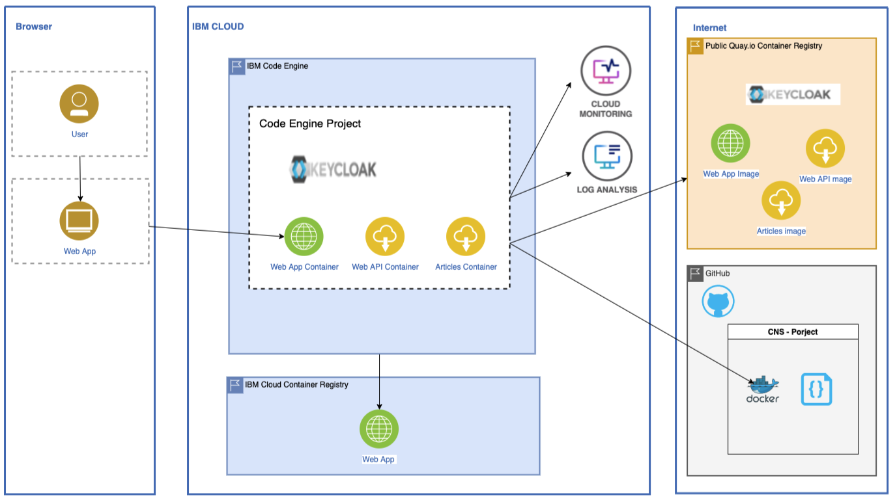

# CODE ENGINE - The ultimate guide for beginners

### Introduction

IBM Cloud Code Engine is a fully managed, serverless platform-as-a-service that runs your containerized workloads, including web apps, micro-services, event-driven functions, or batch jobs. Code Engine even builds container images for you from your source code. All these workloads can seamlessly work together because they are all hosted within the same Kubernetes infrastructure. The Code Engine experience is designed so that you can focus on writing code and not on the infrastructure that is needed to host it. For more information about Code Engine, see <a href="https://cloud.ibm.com/docs/codeengine?topic=codeengine-getting-started"> Getting Started with Code Engine</a>

<b>Please Note:</b> (light-bulb) You dont need to be familiar with creating images or containers all you need to serve it is your source code.

### What can Code Engine do?

- Creates containe images from source code.
- Access source code in repositories
- Pushes images to regestries including Dockerhub and RedHat's Quay.io
- Integrated into IBM Cloud and has access to all IBM Cloud services
- Auto-scales workloads based on the volume of active requests

### Architecture Diagram

### Getting Started

Before running your image on Code Engine, lets start by running it on your local machine.

#### Pre-requistes:

- Have a Dockerfile/ similar created - this file is responsible for describing the image registry details needed to build.
- Podman installed to build, create and run your image locally to test it out

To install Podman, run:

    brew install podman

Now, we want to create a VM on a local machine. To initialise this, run:

    podman machine init
    podman machine start

A name for the newly created VM will be given by default if not already specified. Run the following command to get a list of every VM existent on your local machine.

    podman machine list

To stop running the VM:

    Podman machine stop

To remove the VM:

    Podman machine rm <VM Name>

To build an image, ensure all dependancies are defined in the Dockerfile.

    podman build -t <name of application> <file-path to DockerFile>

Specifying the port you want your VM to run on

    podman run -p <8000:8000> -e <path to the .env file> <image id>

Once the VM is all setup and running, you can then push it onto the cloud

    podman tag<image to tag> <what to tag it as>

Logging into IBM Cloud

    ibmcloud login -sso

Logging into Podman

    podman login uk.icr.io (login to a registry// VM )
    podman login -u iamapikey -p PuoFkeS9vOlmzihk7sXmG2WQLvay1X-XgDeMIHZ26cjA uk.icr.io

    podman tag uk.icr.io/localhost/mod-backend-test/backend:1.2
    podman push uk.icr.io/mod-des-backend/backend:1.2 - local name first then the tag(renaming/retagging the image including he rep and namespace)

tag at the end which is the versioning)
